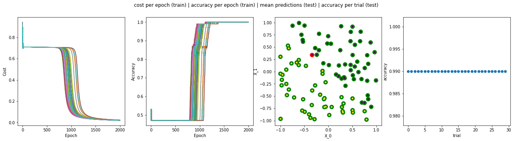

# MLP Neural Network from scratch

Project in Python for Deep Learning Methods course (summer semester 2019/2020) at Warsaw University of Technology.

Solution by Michał Bortkiewicz & Jeremiasz Wołosiuk.

## Content
Multilayer perceptron network implemented in NumPy

### `NeuralNetwrok` class
    
This class consists of a neural network implementation using `Dense` subclass subsequent as layers. 


### Quick start
```python
from src.nnsrc.dense import NeuralNetwork

nn = NeuralNetwork(n_layers=4, n_neurons_per_layer=[10, 20, 30, 1], act_funcs=['sigmoid', 'sigmoid', 'sigmoid', 'sigmoid'],
                   bias=True, problem='classification', error_function='error_function', seed=17)

nn.train(X_train, y_train, epochs=100, batch_size=64, alpha=0.01, beta=0.9)
```

### Exemplary results for classification


